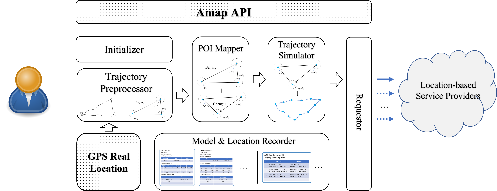
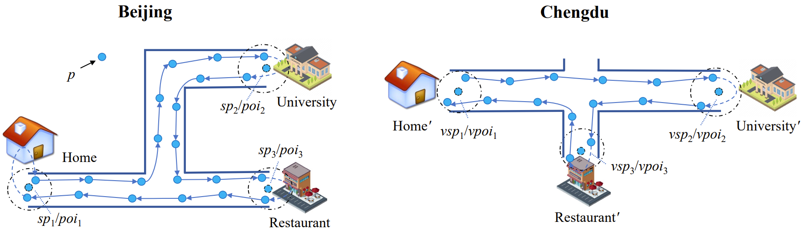
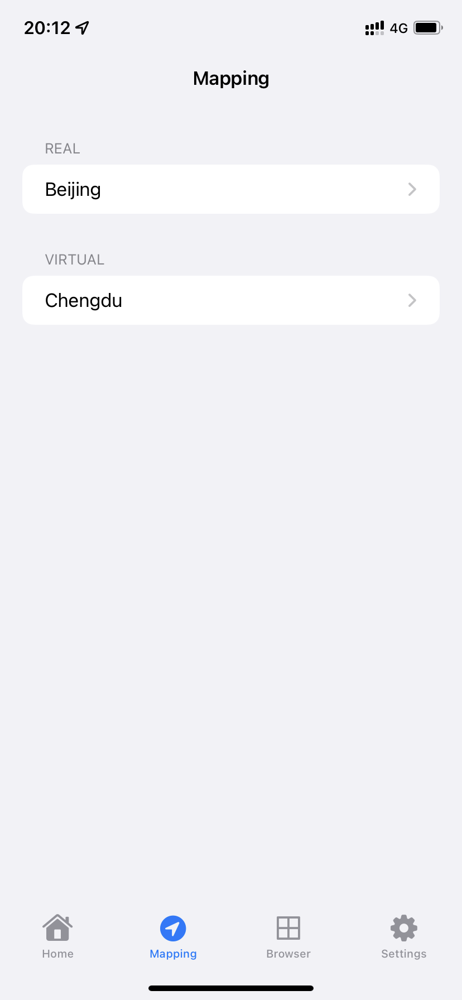
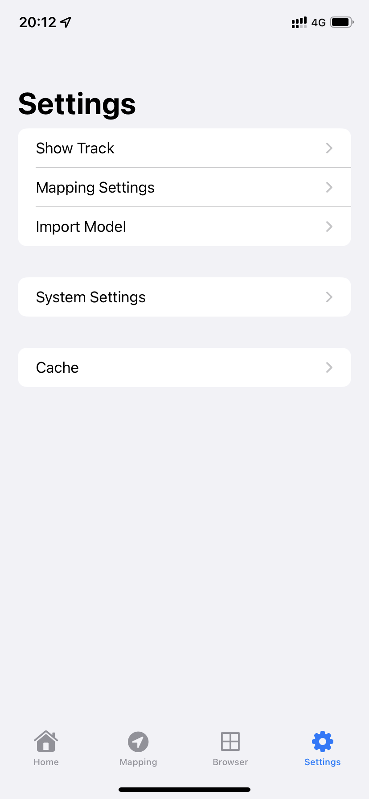
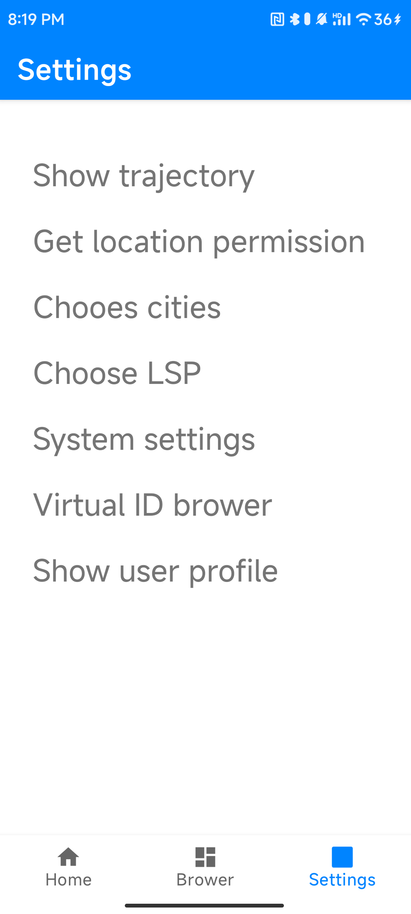

# AnotherMe

## About

**The source code of the paper:** AnotherMe: A Location Privacy Protection System based on Online Virtual Trajectory Generation

## Requirements

* Android 7.0
* iOS 11

## Dispaly

**The interface of iOS:**

**The interface of Android:**

Note: The interface shown above may not be up to date.

Introduction：

1. The contents of folder geolife_dataset folder are trajectory data from 6 users selected from geolife dataset.

2. The contents of folder T-drive_dataset folder are trajectory data from 6 users selected from T-driver dataset.

3. In VTGAs folder, the gen_virtual_traj.py and public_api.py show the virtual trajectory generation algorithm of AnotherMe system. To facilitate testing by others, we will separate the algorithm as a standalone component.

4. TrajectoryExp.zip contains the virtual trajectory generation algorithm, such as MN, MLN and ADTGA, and the data mining algorithm, such as LSTM, TSHN and CNN.

5. TrajectoryExp1.zip contains the virtual trajectory generation algorithm, such as RcDT and GAN.

